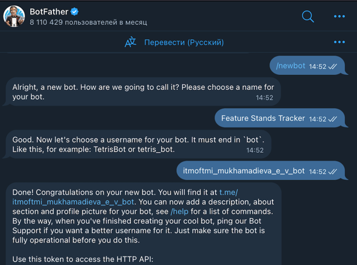
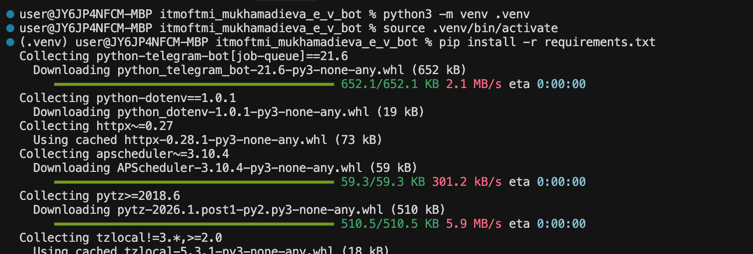
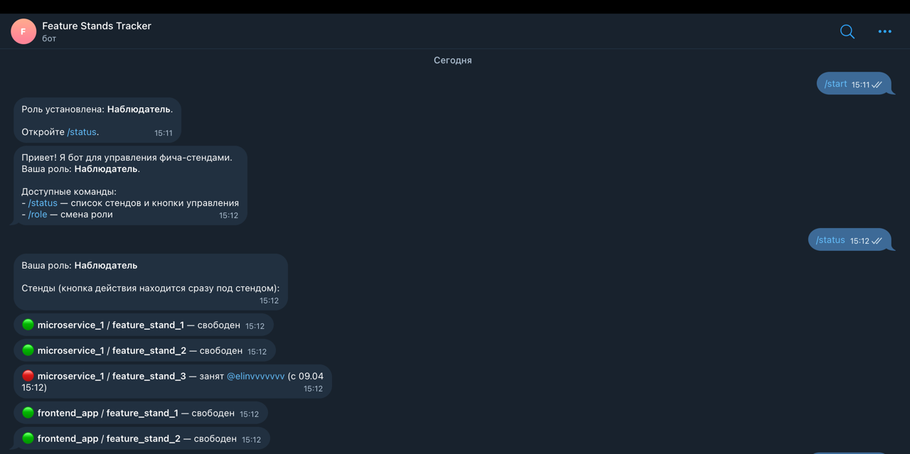
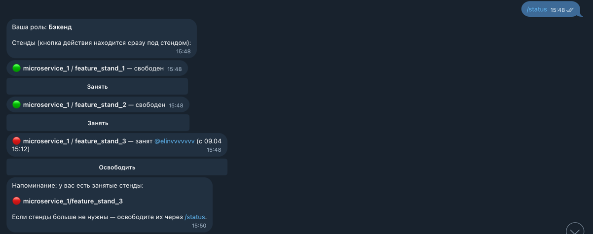

University: [ITMO University](https://itmo.ru/ru/) \
Faculty: [FICT](https://fict.itmo.ru) \
Course: [Vibe Coding: AI-боты для бизнеса](https://github.com/itmo-ict-faculty/vibe-coding-for-business) \
Year: 2025/2026 \
Group: U4125 \
Author: Mukhamadieva Elina Varisovna \
Lab: Lab1 \
Date of create: 09.04.2026 \
Date of finished:

### Шаг 1
#### Бот-менеджер тестовых стендов
- Контролирует занятость инфраструктуры: позволяет бронировать и освобождать бэкенд- и фронтенд-стенды
- Разграничивает доступ по ролям: фильтрует доступные стенды для разработчиков, тестировщиков и админа
- Визуализирует статус в реальном времени: отображает текущую нагрузку через наглядный список с цветовыми индикаторами (🟢/🔴)

### Шаг 2
#### Создала бота через @BotFather

### Шаг 3
#### Промт (он же финальный)
Создай Telegram-бота на Python с использованием библиотеки python-telegram-bot.
Функционал бота:
- Система ролей: При первом запуске пользователь выбирает роль: Бэкенд, Фронтенд, Тестировщик или Наблюдатель. Выбор сохраняется в JSON-файле. Команда /role позволяет сменить роль. Если новая роль не позволяет удерживать текущие стенды (например, переход из Бэкенда во Фронтенд), бот автоматически их освобождает. ID админа будет должен храниться в переменных окружения SUPER_ADMIN_ID.
- Управление стендами: Бот позволяет занимать и освобождать фича-стенды, сгруппированные по микросервисам.
- Разделение доступа: Бэкенд управляет только Backend-стендами; Фронтенд — только Frontend-стендами; Тестировщик и Админ — любыми; Наблюдатель только просматривает статус.
- Ежедневные уведомления: Каждый день в 10:00 (МСК) бот напоминает пользователям о занятых ими стендах через JobQueue.
Какие команды должны быть:
- /start — регистрация, выбор роли и приветствие.
- /role — меню смены текущей роли.
- /status — актуальный список стендов и кнопки управления.
Как бот должен отвечать:
- Визуализация: Свободный стенд — 🟢, занятый — 🔴 (указывать @username и время захвата стенда).
- Интерфейс: Использовать Inline-кнопки. Кнопка действия (Занять/Освободить) должна располагаться сразу под строкой соответствующего стенда.
- Умные кнопки: Бот генерирует кнопки только для разрешенных действий. Если стенд занят другим, кнопку «Освободить» видят только те, у кого есть право его занять. Наблюдатель кнопок не видит.
- Обновление: Сообщение должно редактироваться через edit_message_text при нажатии на кнопки.
Какие данные хранить:
- Хранение данных: Используй JSON-файл (например, data.json).
- Первичное наполнение: Если JSON-файл отсутствует, бот должен создать его со стартовой структурой:
    1. Микросервис microservice_1 со стендами: feature_stand_1 (бэк), feature_stand_2 (бэк), feature_stand_3 (бэк).
    2. Микросервис frontend_app со стендами: feature_stand_1 (фронт), feature_stand_2 (фронт).
Требования:
- Бот должен быть простым и понятным
- Код должен быть хорошо прокомментирован
- Использовать файл для хранения данных (JSON)
- Добавить обработку ошибок
Создай:
1. Файл bot.py с кодом бота
2. Файл requirements.txt с зависимостями
3. Файл README.md с инструкцией по запуску
4. Файл .env.example для примера конфигурации 

### Шаг 4
#### Сгенерированный код
Используемые библиотеки:
- python-telegram-bot (v21.6) с [job-queue]: асинхронный движок бота с планировщиком для уведомлений в 10:00
- python-dotenv: безопасное хранение токена и ID админов в скрытом файле .env
- json: хранение базы данных в простом текстовом формате
- asyncio & zoneinfo: управление асинхронными задачами и точная работа с часовыми поясами (МСК)

### Шаг 5
#### Запуск и тестирование
Активировала виртуальное окружение и установила необходимые зависимости

Видео-демо:
https://drive.google.com/file/d/1oeuHNEuHcZcWI02bN2ttbJBaMb3Av7I9/view?usp=sharing

Скриншоты:

### Выводы
Что получилось хорошо: \
Интерфейс: Бот работает без спама — сообщения не присылаются заново, а редактируются (edit_message_text), сохраняя историю чистой \
UX: Цветовая индикация (🔴/🟢) позволяет оценить состояние инфраструктуры за одну секунду \
Что можно улучшить: \
Масштабируемость: Для работы с десятками стендов стоит перейти с JSON на полноценную БД (SQLite/PostgreSQL)
