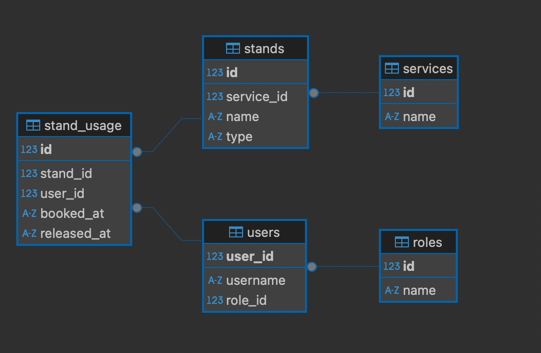
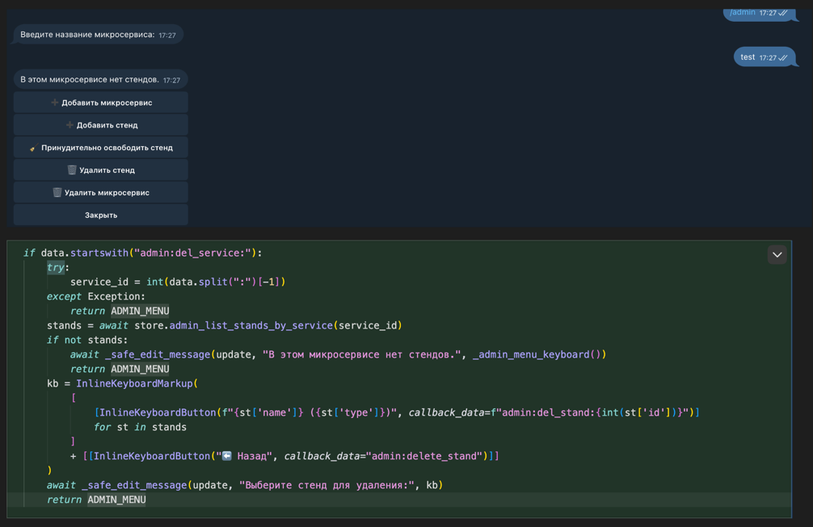
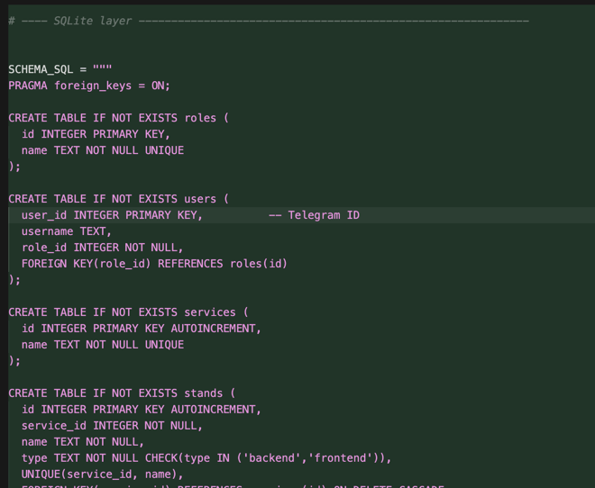
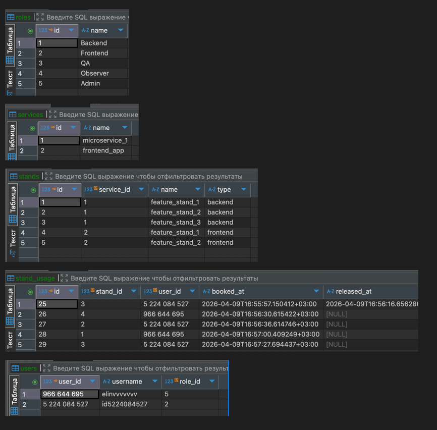
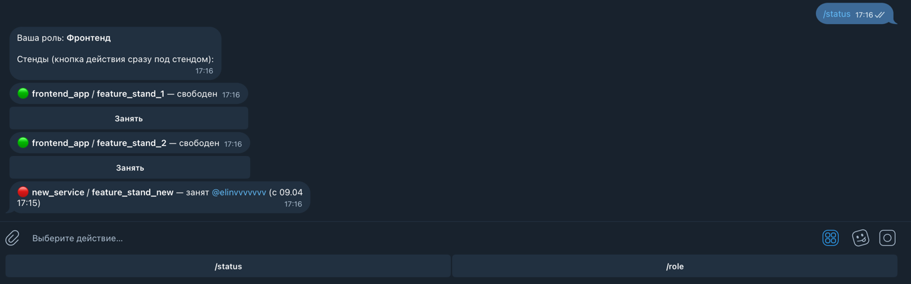
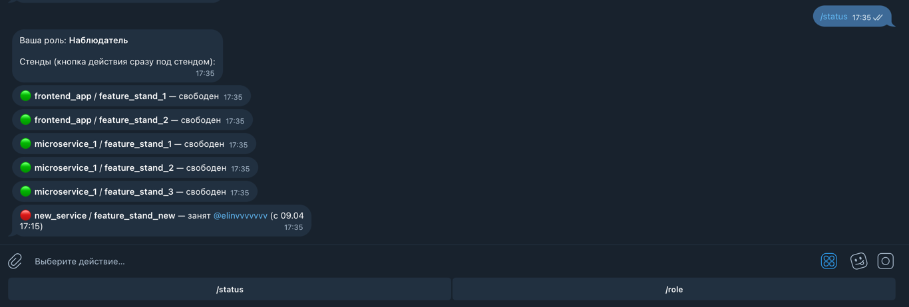
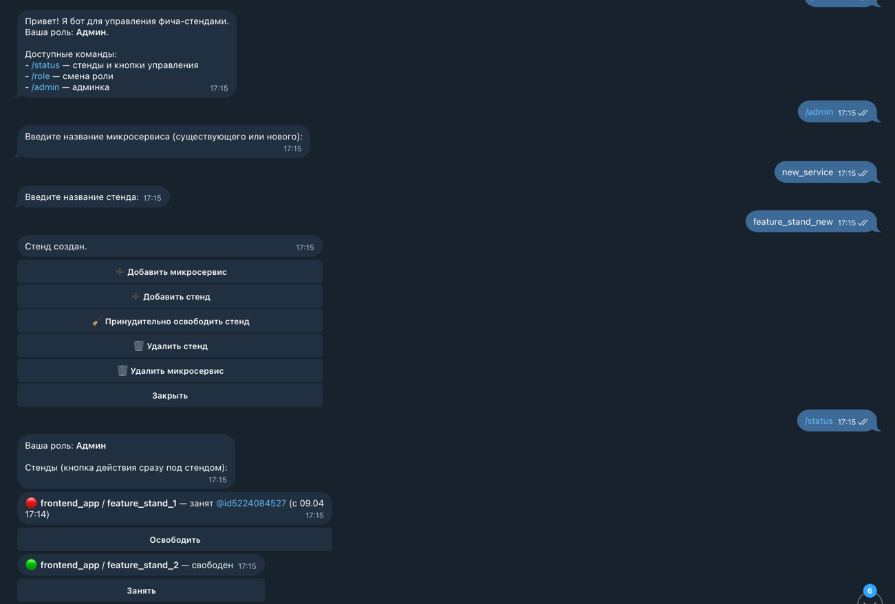

University: [ITMO University](https://itmo.ru/ru/) \
Faculty: [FICT](https://fict.itmo.ru) \
Course: [Vibe Coding: AI-боты для бизнеса](https://github.com/itmo-ict-faculty/vibe-coding-for-business) \
Year: 2025/2026 \
Group: U4125 \
Author: Mukhamadieva Elina Varisovna \
Lab: Lab2 \
Date of create: 09.04.2026 \
Date of finished:

### Шаг 1
#### Для хранения и манипуляции данными была выбрана бд SQLite

### Шаг 2: структура таблиц
* Таблица roles: справочник ролей.
    * id (PK), name (Backend, Frontend, QA, Observer, Admin).
* Таблица users: данные пользователей.
    * user_id (PK Telegram ID), username, role_id (FK roles).
* Таблица services: перечень микросервисов.
    * id (PK), name (название проекта/сервиса).
* Таблица stands: стенды.
    * id (PK), service_id (FK services), name, type (Backend/Frontend).
* Таблица stand_usage: журнал сессий использования стендов.
    * id (PK).
    * stand_id (FK stands): какой стенд используется.
    * user_id (FK users): кто занял стенд.
    * booked_at: время начала использования.
    * released_at: время освобождения. Если значение NULL, значит, стенд занят в данный момент.

### Шаг 3: Промт для Cursor
Улучши моего Telegram-бота, добавив работу с реляционной базой данных SQLite.
Текущий функционал бота:
Бот управляет фича-стендами, разделяя пользователей по ролям (Бэкенд, Фронтенд, Тестировщик, Наблюдатель, Админ). Он позволяет занимать/освобождать стенды через Inline-кнопки с цветовой индикацией (🔴/🟢), фильтрует доступные стенды по ролям и делает ежедневную рассылку в 10:00. Сейчас данные хранятся в data.json.
Новый функционал:
* Миграция данных: Перенеси хранение пользователей, микросервисов и стендов из JSON в базу данных SQLite.
* Динамическое управление (для Админа): Добавь возможность администратору (чьи ID указаны в .env) создавать новые микросервисы и добавлять в них стенды прямо через интерфейс бота, а также удалять и принудительно освобождать.
* Интерактивная админка: Реализуй команду /admin, которая открывает меню для добавления/удаления стендов. Бот должен спрашивать название микросервиса, название стенда и его тип (Backend/Frontend) пошагово.
Данные (Структура SQLite):
* Таблица roles: справочник ролей.
    * id (PK), name (Backend, Frontend, QA, Observer, Admin).
* Таблица users: данные пользователей.
    * user_id (PK Telegram ID), username, role_id (FK roles).
* Таблица services: перечень микросервисов.
    * id (PK), name (название проекта/сервиса).
* Таблица stands: стенды.
    * id (PK), service_id (FK services), name, type (Backend/Frontend).
* Таблица stand_usage: журнал сессий использования стендов.
    * id (PK).
    * stand_id (FK stands): какой стенд используется.
    * user_id (FK users): кто занял стенд.
    * booked_at: время начала использования.
    * released_at: время освобождения. Если значение NULL, значит, стенд занят в данный момент.

Требования:
- Код должен быть простым и понятным
- Добавить обработку ошибок
- Хорошие комментарии в коде
- Сохранить существующий функционал

Создай:
1. Обновленный bot.py
2. Файл с данными (если нужно)
3. Обновленный README.md

### Реализация
Бот написан на python-telegram-bot (асинхронный API). Данные хранятся в SQLite (bot.db) и читаются/меняются через SQLiteStore в bot.py.

Пример обработки ошибок: 

Схема таблицы содержится в переменной SCHEMA_SQL:

Наполнение таблиц в бд:

Скриншоты работы:

Видео-демо работы бота: https://drive.google.com/file/d/199QrZa6pGzAKTBPiHEbV0QjAzqNxPYvq/view?usp=sharing

Что получилось хорошо: \
Модель данных: roles/users/services/stands/stand_usage \
Простая миграция: включается только если БД пустая, не мешает дальнейшей работе \
Понятный интерфейс: один стенд = одно сообщение = кнопка прямо под ним \
Админка внутри бота: добавление/удаление/форс‑освобождение без ручного редактирования файлов 

Что можно улучшить: \
История: вывод истории по стенду (последние N записей stand_usage) и команда "кто часто занимает"
