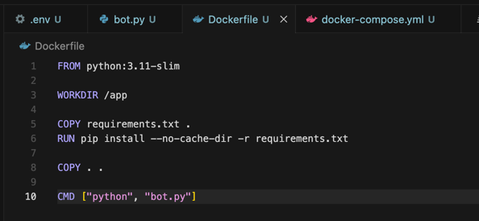
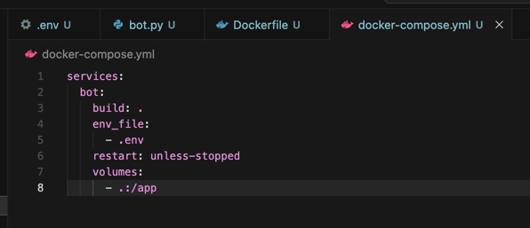
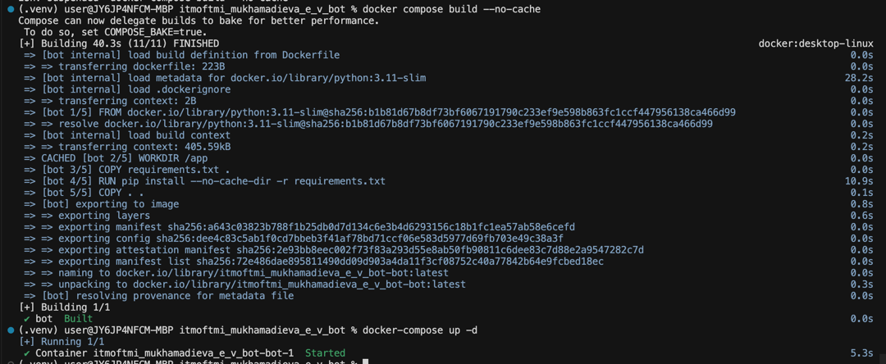
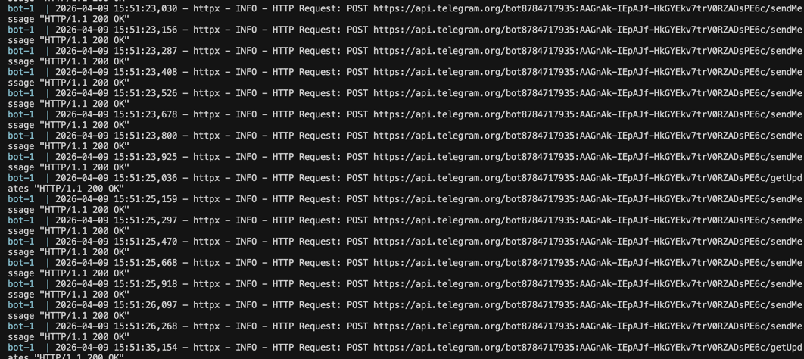
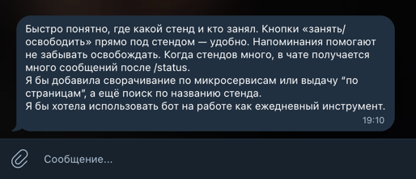
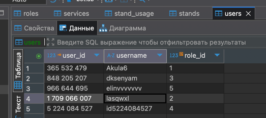
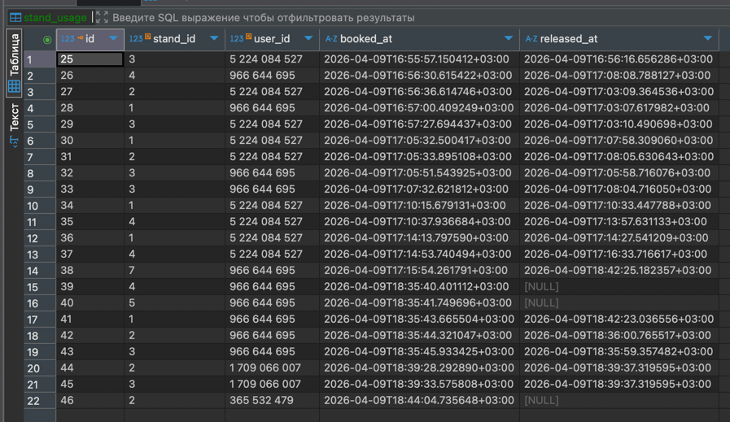
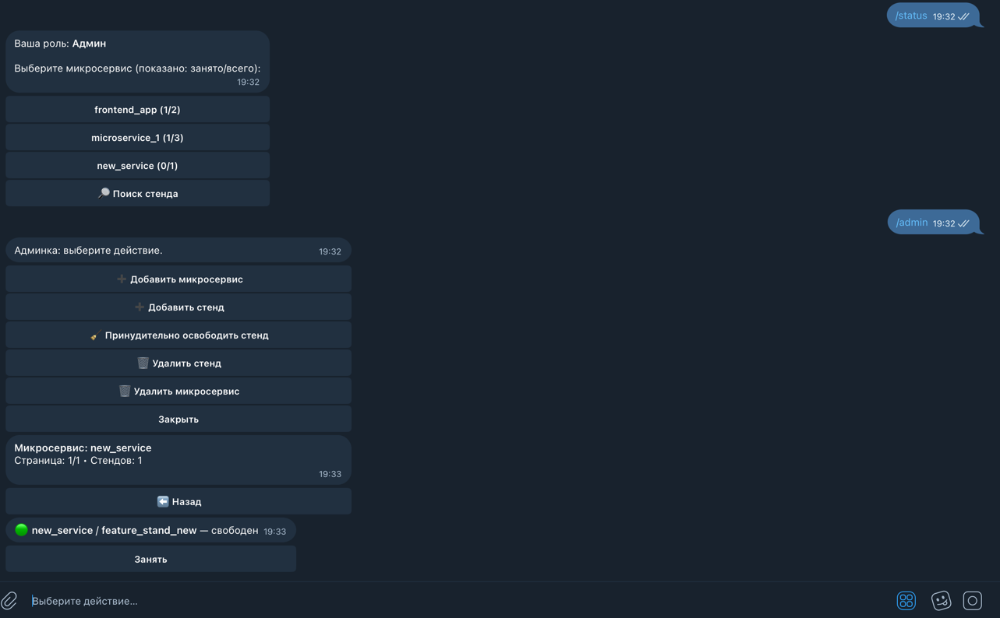
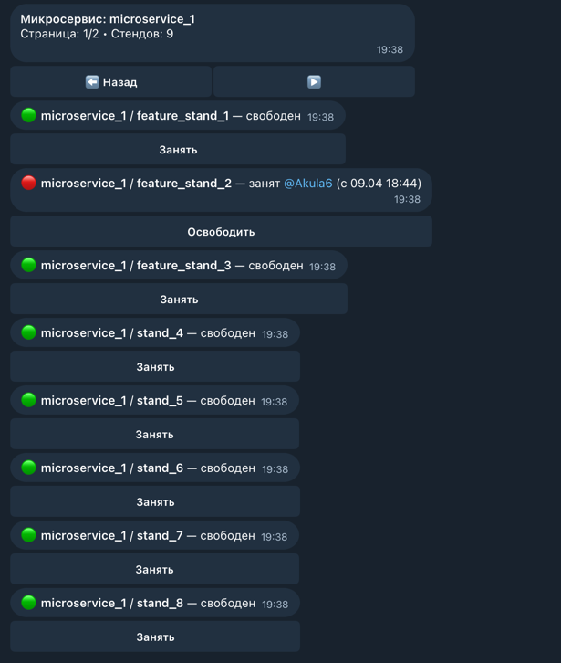
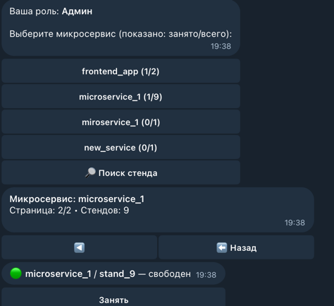

University: [ITMO University](https://itmo.ru/ru/) \
Faculty: [FICT](https://fict.itmo.ru) \
Course: [Vibe Coding: AI-боты для бизнеса](https://github.com/itmo-ict-faculty/vibe-coding-for-business) \
Year: 2025/2026 \
Group: U4125 \
Author: Mukhamadieva Elina Varisovna \
Lab: Lab3 \
Date of create: 09.04.2026 \
Date of finished:

#### Был выбран способ деплоя Docker
Содержимое файлов Dockefile и docker-compose.yml:

Сборка и запуск:

Бот работает корректно, логи:

#### Отзывы
Для тестирования бота и получения фидбэка было выбрано три пользователя и 

Пользователь 1 (Роль: Наблюдатель)
- Что понравилось: Удобство просмотра статуса без лишних кнопок («ничего не сломаешь»). Четкая видимость того, кто и когда занял ресурс.
- Пожелания: Добавить сводный вид (статистику) по количеству занятых стендов на каждый микросервис. 
- Возможность использовать бота как полноценный дашборд для мониторинга.

Пользователь 2 (Роль: Разработчик)
- Что понравилось: Компактный интерфейс («кнопки под каждым стендом») исключает путаницу. Реальное ограничение прав доступа в зависимости от роли.
- Замечания: При большом количестве стендов команда /status создает слишком длинное сообщение.
- Пожелания: Внедрить группировку по микросервисам с использованием сворачиваемых блоков.

Пользователь 3 (Роль: Тестировщик/QA)
- Что понравилось: Быстрая ориентация в статусах стендов. Система ежедневных напоминаний помогает поддерживать дисциплину и вовремя освобождать ресурсы.
- Пожелания: Добавить постраничную навигацию для вывода списка стендов, поиск по названию конкретного стенда и сворачивание разделов микросервисов.

План дальнейшего улучшения:
- Группировка и навигация: Реализовать постраничный вывод или сворачивание списков микросервисов для уменьшения размера сообщений.
- Инструменты поиска: Добавить функцию поиска стенда по текстовому названию.

#### Всего пользователей в боте 5, включая меня:

#### История изменения занятости стендов пользователями:

#### Улучшения сделанные в боте:

- Группировка в /status. Теперь /status показывает список микросервисов с краткой статистикой занято/всего. По нажатию на микросервис бот выводит страницу стендов этого сервиса. \
- Постраничный вывод (навигация). Для стендов выбранного сервиса есть страницы (размер страницы STATUS_PAGE_SIZE = 8) и кнопки вперед/назад + Назад.
- Поиск стенда по названию

Улучшения были продемонстрированы пользователям, замечания были учтены и исправлены, повторный фидбэк был положительным.